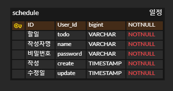

# 프로젝트 이름

> 스케줄 관리 API

### 1) 일정 만들기

- **Method**: `POST`
- URL: `/todos`
- 설명:일정 생성
- **request 예시**:
  ```json
  {
    "id": 1,
    "todo": "할일",
    "writer": "작성자명",
    "create": "YYYY-MM-DD HH-MM-SS"
  }

### 2) 일정 단일 조회

- **Method**: `GET`
- URL: `/todos/{id}`
- 설명:특정 일정 조회
- **reponse 예시**:

    ```json
   {
    "id":1,
    "todo":"할일",
    "writer": "작성자명",
    "create": "YYYY-MM-DD HH-MM-SS"
    }

### 3) 일정 전체 조회

- **Method**: `GET`
- URL: `/todos`
- 설명:전체 일정 조회
    - **reponse 예시**:

        ```json
       {
          [
            {
                "id": 1,
                "todo": "할일",
                "writer": "작성자명",
                "create": "YYYY-MM-DD HH-MM-SS"
            },
            {
                "id": 2,
                "todo": "할일2",
                "nwriter": "작성자명2",
                "create": "YYYY-MM-DD HH-MM-SS"
            },
            {
                "id": 3,
                "todo": "할일3",
                "writer": "작성자명3",
                "create": "YYYY-MM-DD HH-MM-SS"
            },
          ....
          ]
        }

### 4) 일정 수정

- **Method**: `PUT`
- URL: `/todos/{id}`
- 설명:일정 수정
- **reponse 예시**:

    ```json
   {
    "id":1,
    "todo":"할일",
    "writer": "작성자명",
    "create": "YYYY-MM-DD HH-MM-SS"
    "update": "YYYY-MM-DD HH-MM-SS"
    }

### 5) 일정 삭제

- **Method**: `DELETE`
- URL: `/todos/{id}`
- 설명:일정 삭제
- **reponse 예시**:

    ```json
   {
    "msg":"일정이 삭제되었습니다."
    }

### ERD


